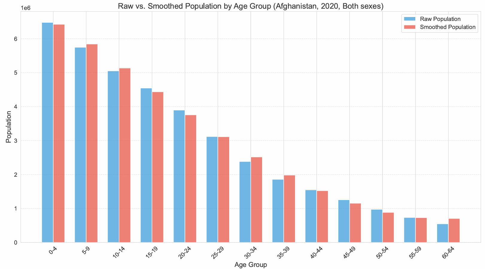
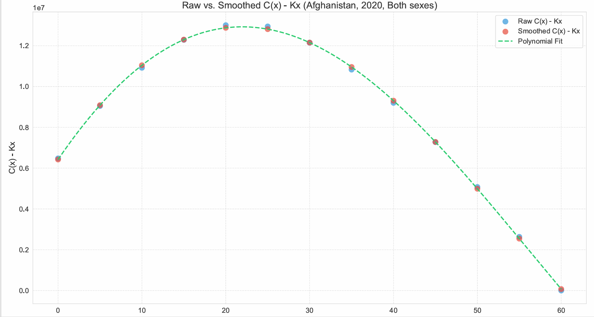
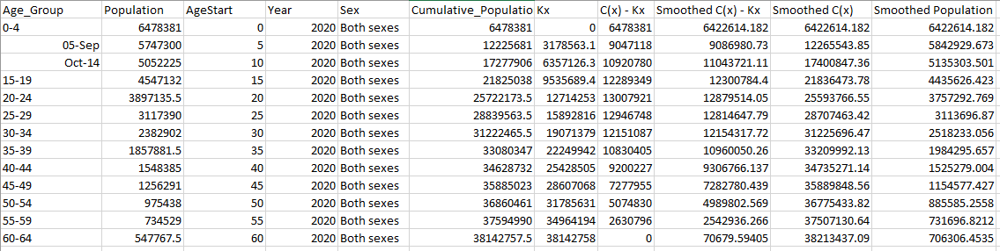
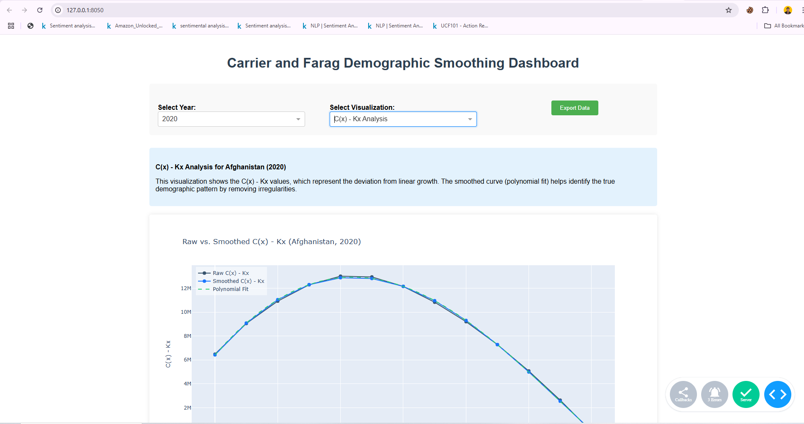
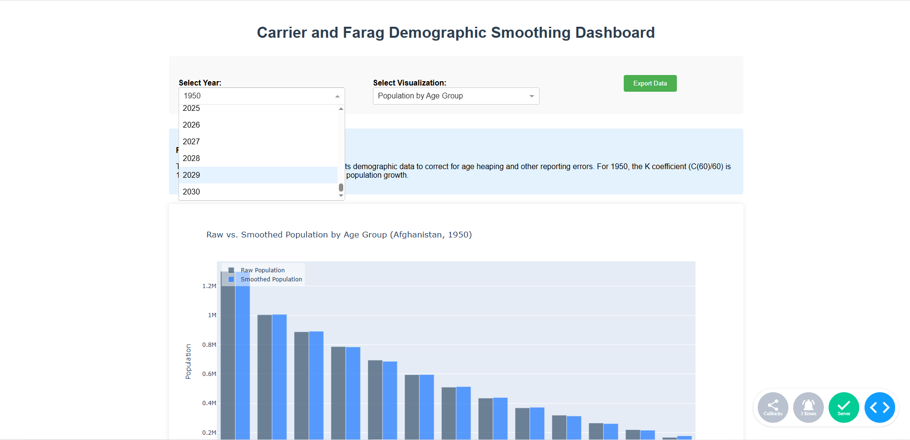
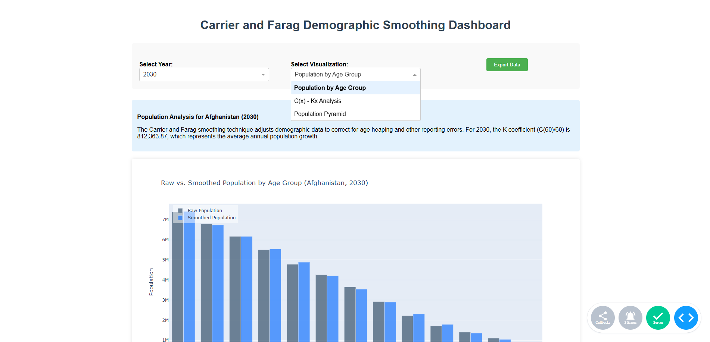
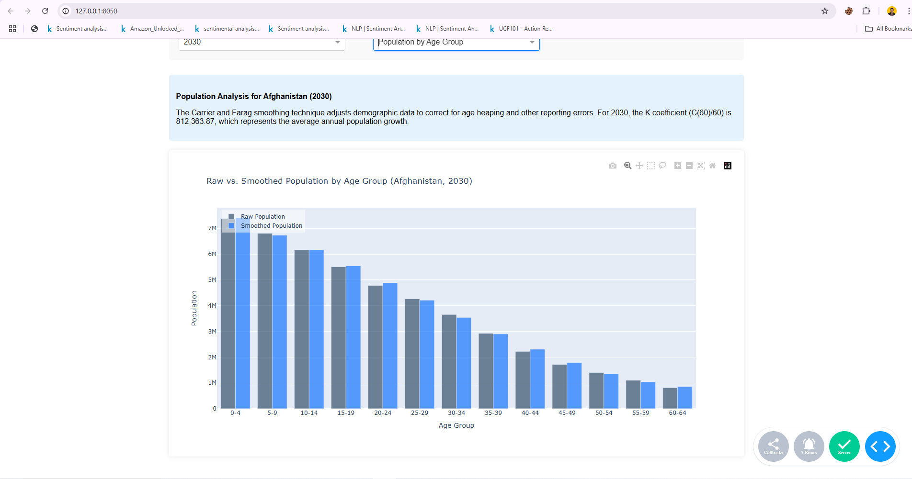
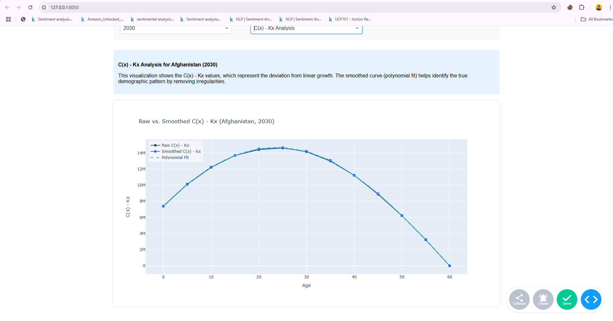

# Carrier and Farag Demographic Smoothing Technique

This project implements the Carrier and Farag demographic smoothing technique for analyzing population data. It includes both a command-line analysis tool and an interactive dashboard for visualizing demographic patterns.

## Table of Contents
- [Overview](#overview)
- [Installation](#installation)
- [Usage](#usage)
- [Features](#features)
- [Results](#results)
- [Dashboard](#dashboard)

## Overview

The Carrier and Farag demographic smoothing technique is a mathematical method used to smooth population data across age groups. This implementation focuses on analyzing Afghanistan's demographic data, providing both analytical tools and interactive visualization capabilities.

## Installation

1. Clone the repository
2. Create a virtual environment:
   ```bash
   python -m venv venv
   source venv/bin/activate  # On Windows: venv\Scripts\activate
   ```
3. Install required packages:
   ```bash
   pip install -r requirements.txt
   ```

## Usage

The project can be used in two modes:

### 1. Command-line Analysis

Run demographic analysis with specific parameters:
```bash
python run.py --analysis --year 2020 --sex "Both sexes" --output ./output
```

### 2. Interactive Dashboard

Launch the dashboard:
```bash
python run.py --dashboard
```
Then open your web browser and navigate to http://127.0.0.1:8050/

## Features

### Data Processing
- Transformation of raw population data into five-year age groups
- Implementation of Carrier-Farag smoothing technique
- Calculation of cumulative population and smoothing coefficients

### Analysis Output

*Population distribution by age groups showing both raw and smoothed data*


*C(x)-Kx analysis demonstrating the smoothing technique's effect*

### Analysis Results

*Sample output showing demographic analysis results for Afghanistan in 2020*

## Dashboard

The interactive dashboard provides a user-friendly interface for exploring demographic data:

### 1. Main Interface

*Dashboard main interface with control panel and visualization area*

### 2. Year Selection

*Interactive year selection for temporal analysis*

### 3. Population Distribution

*Comparative view of raw and smoothed population distributions*

### 4. Smoothing Analysis

*Detailed view of the smoothing technique's impact*

### 5. Data Export

*Export functionality for further analysis*

### Dashboard Features
- Interactive year and sex category selection
- Real-time visualization updates
- Multiple chart types for different analytical perspectives
- Data export capabilities
- Comparative analysis between raw and smoothed data

## Data Source

The demographic data used in this project comes from the UN World Population Prospects, focusing on Afghanistan's population statistics across different age groups and years.

## Output

The analysis generates several output files in the `output` directory:
- CSV files containing raw and smoothed population data
- Demographic analysis reports
- Visualization exports

## Project Structure

```
├── data/
│   └── population.csv         # Raw demographic data
├── notebooks/                 # Jupyter notebooks for analysis
├── output/                    # Analysis outputs
├── screenshots/               # Visual documentation
├── main.py                    # Core analysis implementation
├── run.py                     # Command-line interface
├── run_dashboard.py           # Dashboard implementation
└── requirements.txt           # Project dependencies
```